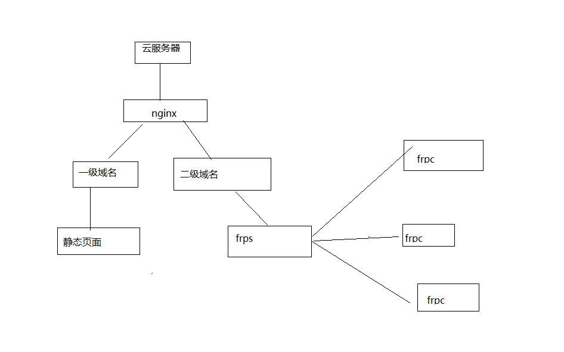
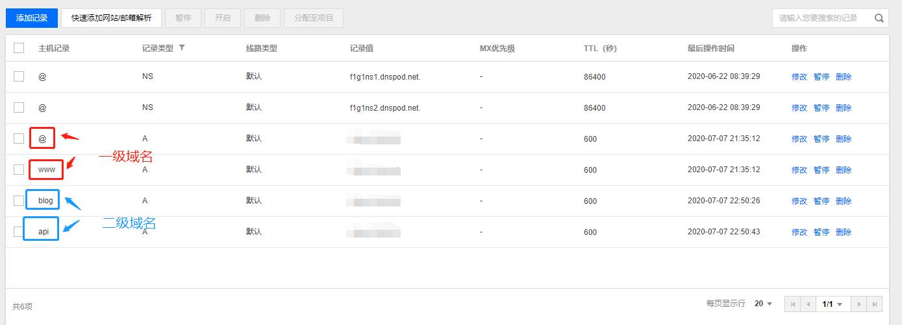

​		申请的域名终于下来了，再加上之前买的云服务器，终于可以搞一搞了。由于服务器只有一个`IP`和域名，80端口用来访问很方便，但是有些接口回调只支持80端口，比如微信公众号。因此，需要将80端口配置的更加通用一些。

<!-- more -->

### 软件

- frp
- nginx

### 流程



​	整体流程如图所示，`nginx`根据一级域名和二级域名进行方向代理，这样的话主域名代理到`Hexo`博客，二级域名通过`frp`还可以穿透到其他机器，扩展起来也很方便，添加一个`frp`客户端就可以了。：

### 操作

- #### 添加域名解析

  域名解析一般在购买的服务商那里都会有配置，这里我买的是腾讯云，所以展示腾讯云配置

  

- #### nginx配置代理规则

  nginx代理规则很简单，根据一级域名和二级域名的不同进行代理就好了

  ```bash
      #二级域名配置 转发到本机frps
      server {
          listen          80;
          server_name     *.yourdomain.com;
          location /{
                  #服务器的ip和端口   http://[ip]:[port]   vhost_http_port
                  proxy_pass http://127.0.0.1:81;
                  proxy_set_header Host $host;
                  proxy_set_header X-Real-IP $remote_addr;
                  proxy_set_header X-Forwarded-For $proxy_add_x_forwarded_for;
                  proxy_hide_header X-Powered-By;
          }
      }
      #主域名配置
      server {
          listen       80;
          server_name  yourdomain.com;
          #配置hexo博客地址
          location / {
               root   /home/git/projects/blog;
               index  index.html index.htm;
          }
        }
  ```

- #### frp配置

  frps.ini这里没有什么需要特别改动的，使用的方式还是通过二级域名管理客户端 [frp官方说明]( [https://github.com/fatedier/frp/blob/master/README_zh.md#%E8%87%AA%E5%AE%9A%E4%B9%89%E4%BA%8C%E7%BA%A7%E5%9F%9F%E5%90%8D](https://github.com/fatedier/frp/blob/master/README_zh.md#自定义二级域名) )

  ```bash
  #配置路由，开启二级域名配置
  subdomain_host = yourdomain.com
  # 注意启动端口与 nginx 代理二级域名后的端口一致
  vhost_http_port = 81
  vhost_https_port = 443
  ```

服务器配置到这里就ok了，接下来只要在`frpc`客户端对二级域名配置即可。通过test.yourdomain.com就可以访问内网的web服务，接口回调也很方便~