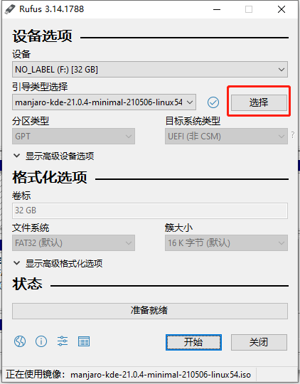
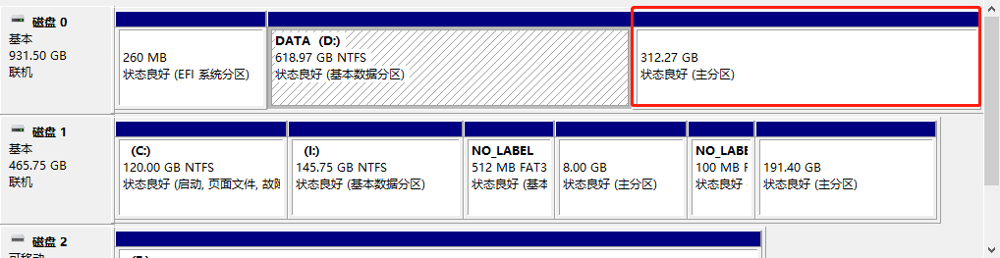
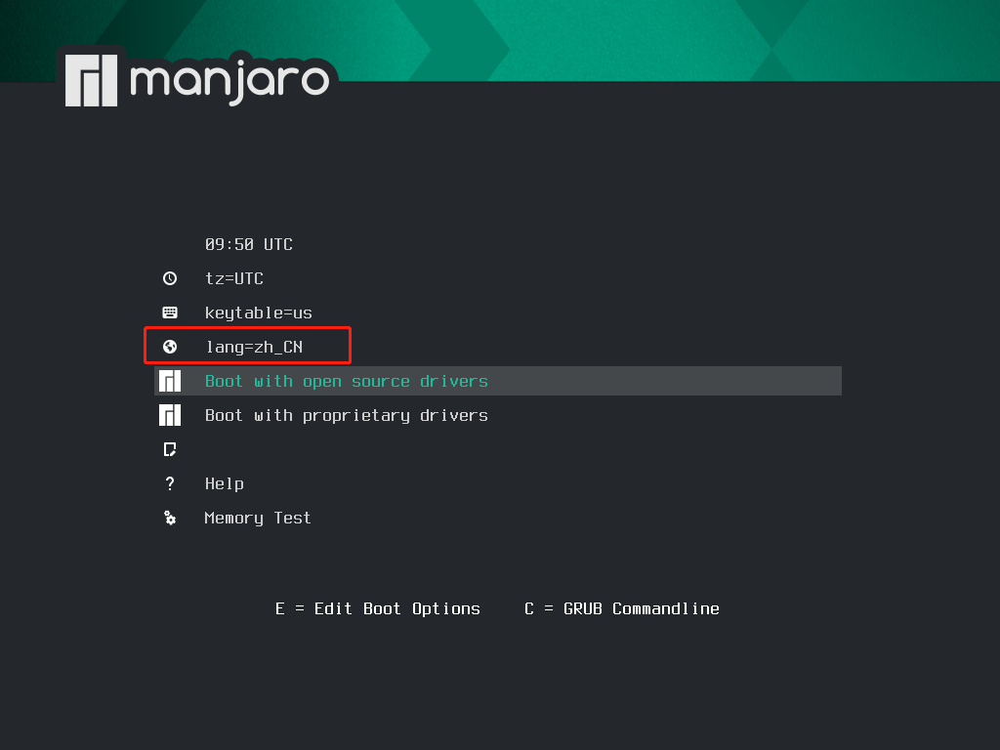

​	之前在虚拟机上装过 Manjar-xfce版本，感觉还不错。这次直接在笔记本上安装双系统，版本使用 `Manjaro-Kde`

<!-- more -->
## 环境
### 硬件

- 笔记本电脑
- u盘

### 软件

- Rufus	[下载地址](https://rufus.ie/zh/)
- Manjaro Kde [下载地址](https://manjaro.org/downloads/official/kde/)

## 准备

####  制作启动盘

1. 打开 `Rufus`软件

2. 点击 【选择】找到下载好的 ios

   

3. 点击【开始】

#### win10 分区

在原有win10 磁盘中分区一块分区给新的系统使用

1. 右键【我的电脑】-【管理】-【存储】-【磁盘管理】

2. 找一块比较大的磁盘，【右键】-【压缩卷】

   压缩完后不用格式化，由于我的笔记本上还装了一块固态，所有我压缩了两个分区出来(200G固态，300G机械)，后面系统手动分区使用。

   

## 安装

#### 设置从U盘启动

各种品牌的笔记本启动方式可能不一样，我的是惠普光影精灵，开机后按【esc】键，然后【F9】进入启动方式。

#### 初始配置

- 设置语言为简体中文

- 如果是双显卡就选择 `Boot with proprietary drivers` , 不是就选择 `Boot with open source drivers`

- 回车键启动





#### 正式安装

##### 语言

选择中文简体

##### 位置

选择上海

##### 分区

选择【手动分区】

点击【Free Space】创建分区

由于我这里有两块磁盘，所以我将 `/home` 挂载在 机械硬盘上（这里要注意切换磁盘）

双系统还需要一个引导分区 `/boot/efi`

> ```
> # 分区配置
> /boot/efi	100MB
> /boot 		512MB 		
> /swap 		8192MB 		
> / 			固态剩余空间 	
> /home 		300G 		
> ```

整体的分区如下

| 大小    | 分区类型 | 文件系统  | **挂载点** | **标记** |
| ------- | -------- | --------- | ---------- | -------- |
| 100MB   | 主分区   | fat32     | /boot/efi  | boot     |
| 512MB   | 主分区   | fat32     | /boot      | boot     |
| 8192MB  | 主分区   | linuxswap | -          | swap     |
| 40960MB | 主分区   | xfs       | /          | lvm      |
| 300G    | 主分区   | xfs       | /home      | lvm      |

