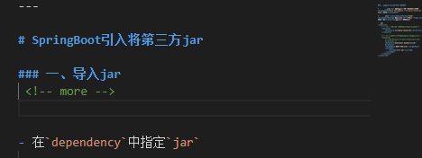
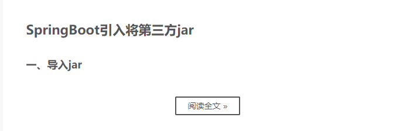

### 生成新的文章

- -p：表示path 路径

- hexo/hexo：表示在`_posts`目录下生成 `hexo/hexo.md`文件（有一层文件夹）

```
hexo new page -p hexo/hexo
```

## 文章分类

​	`categoryies`这个选项有两种配置

- **子分类**  

  下面的分类配置会将该文章放到 `Sports/Baseball` 这个分类下。

  ```bash
  # 方式一
  categories:
    - Sports
    - Baseball
  # 方式二
  categories: [Sports,Baseball]
  ```

  上面两种写法最终的效果都是一样的，都是将文章放在了一个子分类目录下。

- **多个分类**

  将文章同时分到两个或者多个不同的类目下

  ```bash
  categories:
    - [Sports]
    - [Baseball]
  ```

  只需要用中括号将独立的分类括起来即可，这样上面的文章就会被分类在 `Sports` 和 `Baseball` 这两个不同的目录中了。

  扩展一下，如果我们要将其分类到 `Sports/Baseball` 和 `Play` 两个不同的目录下（一个是子目录，一个是一级目录），我们该怎么写呢？如下：

  ```bash
  categories:
    - [Sports,Baseball]
    - [Play]
  ```

## 文章标签

​	将文章添加多个 `tag`，这里也有两种写法

  ```bash
# 方式一
tags: [jQuery, 表格， 表单验证]
# 方式二
tags:
- jQuery
- 表格
- 表单验证
  ```


### 设置文章摘要

​	在内容中插入一行

```bash
 <!-- more -->
```



​	效果如下

​	

### 生成本地生成静态文件：`hexo g`

### 将本地静态文件推送至Github：`hexo d`

### 在文章中使用图片

- 在hexo根目录配置文件`_config.yml`设置属性

  ```
   post_asset_folder:true
  ```

- 在hexo的目录下执行

  ```
  npm install https://github.com/CodeFalling/hexo-asset-image --save   
  ```

- 使用图片

  ```
  
  ```
 
  