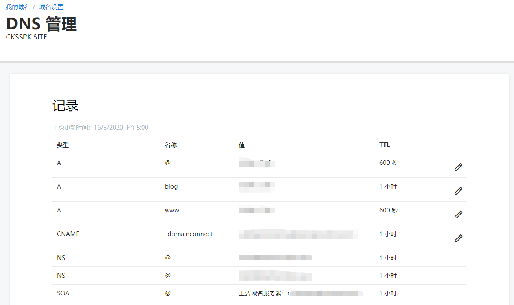
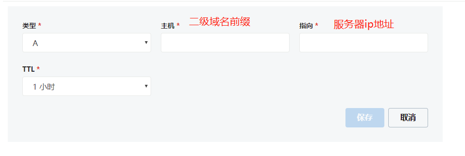

 &ensp;&ensp;之前是对`hexo`进行了`git`配置，可以实现多台电脑对`hexo`博客进行维护。但是在使用过程中发现访问速度非常慢（部署在`github`上），这里通过`git`裸仓库+`nginx`作为网页服务器，实现将`hexo`博客部署在自己的服务器上。
<!-- more -->

## 基本环境

- 服务器 
  - 可以是云主机、`vm`上的虚拟机、我这里使用树莓派
  - 服务器已安装`nginx`、`git`
- 本地
  - `win10`安装`node`环境
  - 基本的`hexo`博客创建、运行、部署
  - `git`环境

## 开始

##### 搭建远程Git私库

- 登录到服务器 可以通过`xshell 5`等软件

- 创建用户并配置仓库

  ```bash
  #1. 创建用户
  useradd git
  #1.1 debain创建用户语法有差异
  useradd -m -s /bin/bash git
  #2. 设置密码
  passwd git
  #3. 切换用户 这步很重要，不切换用户后面会很麻烦
  su git
  cd /home/git/
  #4. 项目存在的真实目录
  mkdir -p projects/blog
  mkdir repos && cd repos
  #5. 创建一个裸露的仓库
  git init --bare blog.git
  cd blog.git/hooks
  #6. 创建 hook 钩子函数，输入了内容如下
  vi post-receive
  ```

  ```bash
  #!/bin/sh
  git --work-tree=/home/git/projects/blog --git-dir=/home/git/repos/blog.git checkout -f
  ```

- 添加完毕后修改权限

  ```bash
  chmod +x post-receive
  exit // 退出到 root 登录
  chown -R git:git /home/git/repos/blog.git // 添加权限
  
  ```

- 测试**git仓库**是否可用

  ```bash
  # 在win10找一个空文件夹
  git clone git@server_ip:/home/git/repos/blog.git
  
  # 2. 进行正常git操作流程
  cd blog
  echo "hello">>index.html
  git add .
  git commit -m "init"
  git push 
  
  #3. 查看是否提交成功
  ```

- 建立ssh信任关系，在**本地电脑**

  ```bash
  #1. 进入Gitbash
  ssh-copy-id -i C:/Users/yourname/.ssh/id_rsa.pub git@server_ip
  #2. 测试能否登录
  ssh git@server_ip
  ```

  **注**：此时的 ssh 登录 git 用户不需要密码！否则就**有错**，请仔细重复步骤 3-5

- 为了安全起见禁用 git 用户的 shell 登录权限，从而只能用 git clone，git push 等登录

  ```bash
  #1. 查看 git-shell 是否在登录方式里面
  cat /etc/shells
  #2. 查看是否安装
  which git-shell
  vi /etc/shells
  #3. 添加上2步显示出来的路径，通常是 /usr/bin/git-shell
  ```

- 修改`/etc/passwd`中的权限

  ```bash
  #1.  将原来的
  git:x:1000:1000::/home/git:/bin/bash
  #2. 修改为
  git:x:1000:1000:,,,:/home/git:/usr/bin/git-shell
  ```

  **注**：`git:x:1000:1000::/home/git:/bin/bash`中的`userId`不要随便修改，使用原来的值

##### `nginx`配置

- 修改`ngixn.config`文件

  ```bash
  #1. 修改顶部user 为root
  user root;
  
  #2. 修改server配置
  server {
  		listen       80;
  	    server_name  localhost;
          location / {
      		 #地址修改为项目git仓库地址
               root   /home/hexo/projects/blog;
               index  index.html index.htm;
           }
   
           error_page   500 502 503 504  /50x.html;
           location = /50x.html {
               root   html;
           }
        }
  ```

##### 部署发布

- 编辑`hexo`博客中的`_config.yml`文件

  ```bash
  # Deployment
  ## Docs: https://hexo.io/docs/deployment.html
  deploy:
    type: git
    repo: git@server_ip:/home/git/repos/blog.git
    branch: master
  
  ```

- 通过命令发布

  ```bash
  hexo g -d
  ```


## 二级域名配置

#### 域名配置

这里使用的`GoDaddy`，地址：https://sg.godaddy.com/zh?ci=，

- 进入`DNS`管理

  查看记录所示

  

- 添加记录

  比如类型：A; 主机：api; 服务器地址：xx.xx.x.xx

  

- 点击保存，而后可以在`cmd`中`Ping`地址，查看是否通过，但是一般生效需要时间。

#### `frp`配置

> ### 自定义二级域名					[官方地址](https://github.com/fatedier/frp/blob/master/README_zh.md#%E8%87%AA%E5%AE%9A%E4%B9%89%E4%BA%8C%E7%BA%A7%E5%9F%9F%E5%90%8D)
>
> 在多人同时使用一个 frps 时，通过自定义二级域名的方式来使用会更加方便。
>
> 通过在 frps 的配置文件中配置 `subdomain_host`，就可以启用该特性。之后在 frpc 的 http、https 类型的代理中可以不配置 `custom_domains`，而是配置一个 `subdomain` 参数。
>
> 只需要将 `*.{subdomain_host}` 解析到 frps 所在服务器。之后用户可以通过 `subdomain` 自行指定自己的 web 服务所需要使用的二级域名，通过 `{subdomain}.{subdomain_host}` 来访问自己的 web 服务。
>
> ```
> # frps.ini
> [common]
> subdomain_host = frps.com
> ```
>
> 将泛域名 `*.frps.com` 解析到 frps 所在服务器的 IP 地址。
>
> ```
> # frpc.ini
> [web]
> type = http
> local_port = 80
> subdomain = test
> ```
>
> frps 和 frpc 都启动成功后，通过 `test.frps.com` 就可以访问到内网的 web 服务。
>
> **注：如果 frps 配置了 `subdomain_host`，则 `custom_domains` 中不能是属于 `subdomain_host` 的子域名或者泛域名。**
>
> 同一个 http 或 https 类型的代理中 `custom_domains` 和 `subdomain` 可以同时配置。

- 进入云服务器，修改`frps.ini`文件

  ```bash
  #配置路由，开启二级域名配置
  [common]
  subdomain_host = cksspk.site
  ```

  重启`frp`

  ```bash
  systemctl restart frps
  ```

  

- 进入树莓派，打开`frpc.ini`文件

  ```
  #配置路由，开启二级域名配置
  subdomain = api.cksspk.site
  
  #记得将cuttom_domains注释掉
  ```

  重启`frp`

  ```bash
  systemctl restart frpc
  ```

#### `nginx`配置

- 修改`nginx.conf`

  ```bash
  #2. 修改server配置
  server {
  		listen       80;
  		#将server_name修改改成对应域名
  	    server_name  www.blog.cksspk.site;
          location / {
      		 #地址修改为项目git仓库地址
               root   /home/hexo/projects/blog;
               index  index.html index.htm;
           }
   
           error_page   500 502 503 504  /50x.html;
           location = /50x.html {
               root   html;
           }
        }
  ```

- 重启`nginx`

  ```
  nginx -s reload
  ```

## 最后

浏览器访问www.blog.cksspk.site 即可出现，锤子，配置了半天，外网访问还是慢，可能因为服务器是国外的原因，白嫖的缺点。。。。