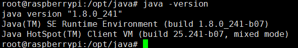
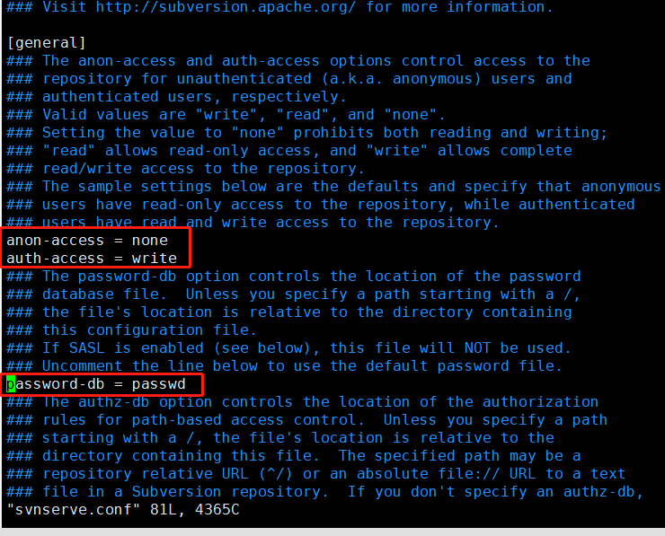
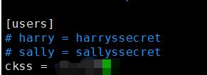
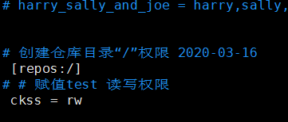
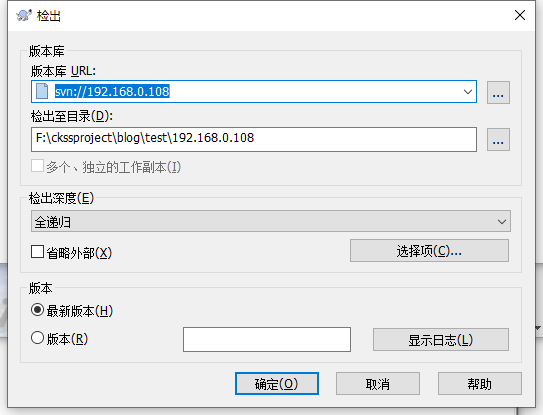

树莓派硬件为3b+，系统版本debian9.9

<!-- more -->

查看树莓派系统参数命令如下

```bash
getconf LONG_BIT        # 查看系统位数
uname -a            # kernel 版本
/opt/vc/bin/vcgencmd  version   # firmware版本
strings /boot/start.elf  |  grep VC_BUILD_ID    # firmware版本
cat /proc/version       # kernel
cat /etc/os-release     # OS版本资讯
cat /etc/issue          # Linux distro 版本
cat /etc/debian_version     # Debian版本编号
```

## 配置wifi连接

1. 打开文件

   ```bash
   vim /etc/wpa_supplicant/wpa_supplicant.conf
   ```

2. 增加配置

   ```bash
   network={
       ssid="wifi名称"
       psk="wifi密码"
       priority=4 连接优先级，数字越大优先级越高（不可以是负数）
       #scan_ssid:连接隐藏WiFi时需要指定该值为1
   }
   ```

3. 拔网线，重启

   ```bash
   reboot
   ```

## 配置静态IP

路由器的WiFi一般为自动分配，如果经常开关机都要去路由器上查看IP地址，很麻烦，因此这种情况配置静态IP就很方便

1. 打开文件

   ```bash
   vim /etc/dhcpcd.conf
   ```

2. 增加配置

   ```bash
   # 指定接口 eth0
   interface eth0
   # 指定静态IP，/24表示子网掩码为 255.255.255.0
   static ip_address=192.168.1.20/24
   # 路由器/网关IP地址
   static routers=192.168.1.1
   # 手动自定义DNS服务器
   static domain_name_servers=114.114.114.114
   ```

3. 重启

   ```bash
   reboot
   ```

## JAVA环境（jdk1.8）

### 下载jdk

1. 进入java[官网](https://www.oracle.com/java/technologies/javase-jdk8-downloads.html)
2. 选择 `Linux ARM 32 Hard Float ABI` 版本下载
3. 通过`xshell`软件上传至树莓派

### 解压配置环境

1. 在软件目录解压

   ```bash
   tar -zxvf jdk-8u241-linux-arm32-vfp-hflt.tar.gz
   ```

2. 编辑配置文件

   ```bash
   vim /etc/profile
   ```

3. 在后面写入

   ```
   export JAVA_HOME=/opt/java/jdk1.8.0_241
   export PATH=$JAVA_HOME/bin:$PATH
   export CLASSPATH=.:$JAVA_HOME/lib/dt.jar:$JAVA_HOME/lib/tools.jar
   ```

### 保存验证

1. 修改文件后立即生效

   ```bash
   source /etc/profile
   ```

2. 验证，输入 `java -version`，查看打印输出

   ```bash
   java -version
   ```

   

## 安装SVN服务器

### 服务器配置

1. 安装svn服务器

   ```bash
   sudo apt-get install subversion -y
   ```

2. 创建仓库, 使用/home/pi/svn/svn_ckss作为仓库根路径

   ```bash
   svnadmin create /home/pi/svn/svn_ckss
   ```

3. 修改配置文件

   ```bash
   vim /home/pi/svn/svn_ckss/conf/svnserve.conf 
   ```

   

   ​	**去掉注释，一定要删除空格！！！ 让配置顶格写！！！**

4. 配置用户信息

   ```bash
   vim /home/pi/svn/svn_ckss/conf/passwd 
   ```

   

5. 修改权限配置

   ```bash
   vim /home/pi/svn/svn_ckss/conf/authz 
   ```

   

6. 启动服务

   ```bash
   svnserve -d -r /home/pi/svn/svn_ckss
   ```

7. 查看启动

   ```bash
   ps -ef | grep svnserve
   ```

   启动成功

   ```bash
   root     19497     1  0 12:54 ?        00:00:00 svnserve -d -r /home/pi/svn/svn_taoge/
   root     19530 19172  0 13:13 pts/0    00:00:00 grep svnserve
   ```

   

8. 停止服务

   ```
   killall svnserve
   ```

如果使用防火墙需要将3690端口开放

### 客户端配置

客户端通过***tortoiseSVN***进行连接，下载地址 https://tortoisesvn.net/downloads.html

另外，中文语言包需要通版本保持一致

输入SVN服务器地址 :svn://192.168.0.108进行检出





